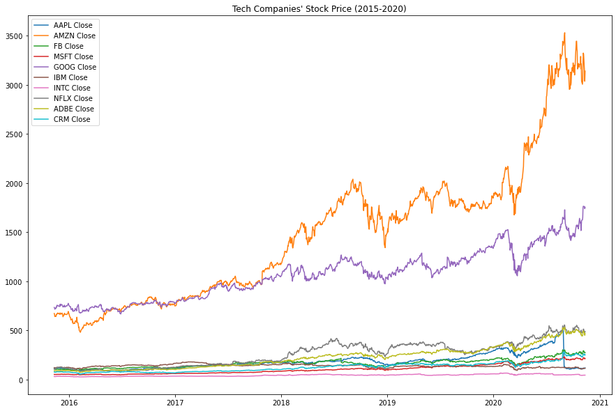
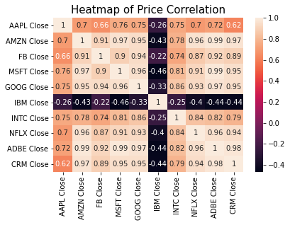
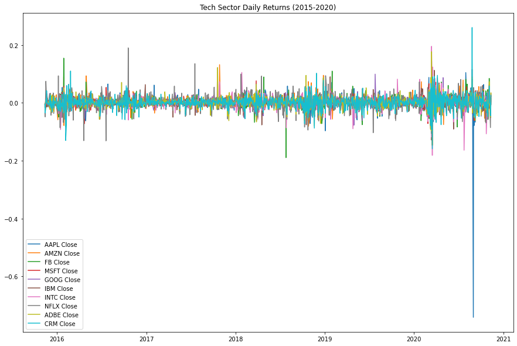
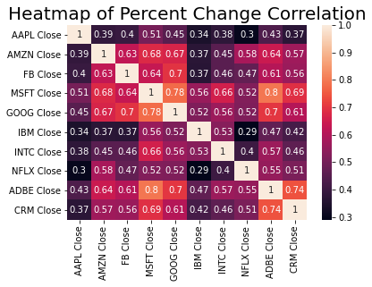
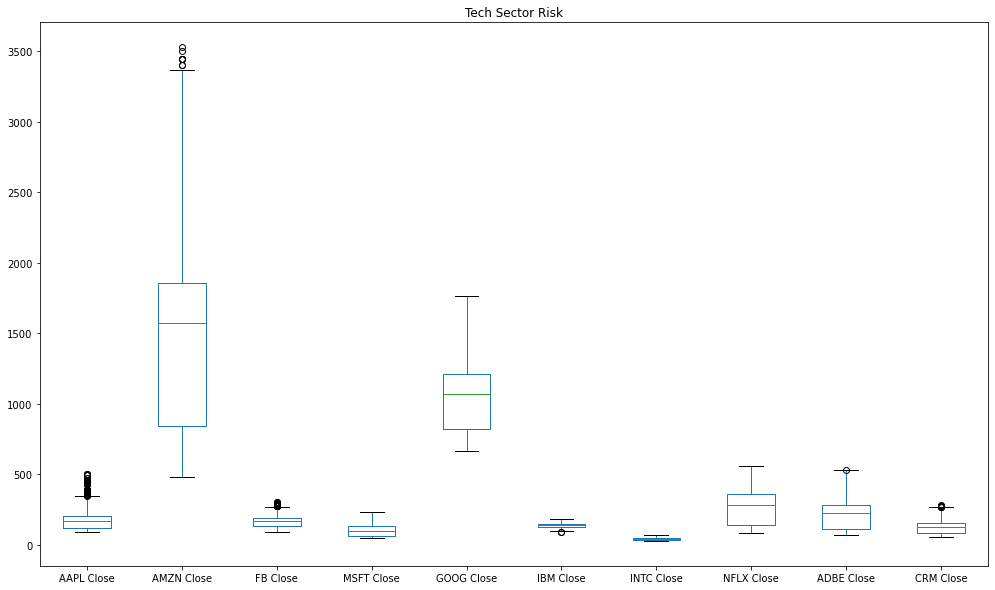
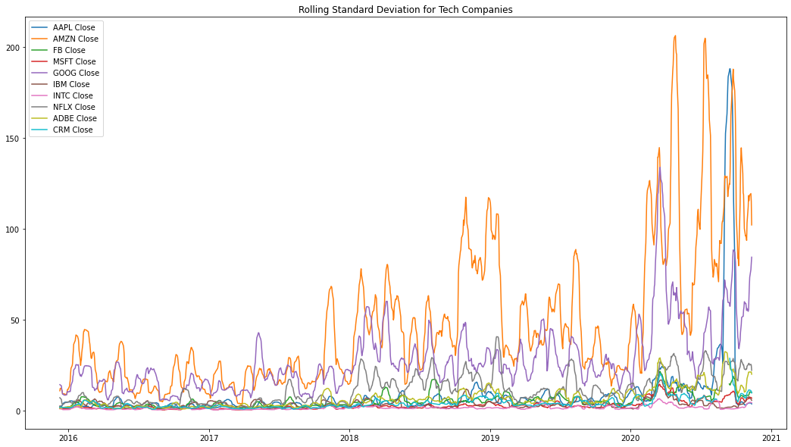
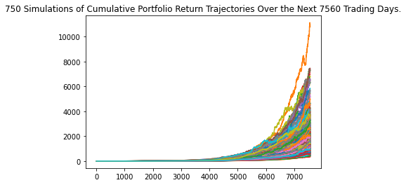

# Technology Investment Analysis Project

By: Justin John

## Performance

### Data visualizations created based on the technology sector:

#### Stock Price 5-year Performance

 
 
#### Heatmap of Price Correlation

  
  
#### Daily Returns Percent Change (5-year)

  

#### Heatmap of Percent Change Correlation

  
  
  
## Risk

#### Box Plot Tech Sector Risk

  
#### Box Plot Tech Sector Risk

  
#### Monte Carlo Simulation Forecasting Cumulative Returns for 30 Years

  
